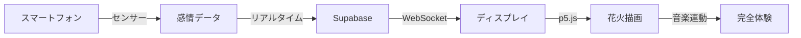

# 🎆 Sky Canvas - 空に描く、あなたの創造力

> **Vibes = 花火 = 音** の融合体験  
> あなたの感情が花火になる。音楽と光が織りなす全く新しい体験。

[](https://your-deployed-url.vercel.app)
[](https://nextjs.org/)
[](https://www.typescriptlang.org/)
[](https://supabase.com/)

## 🌟 プロジェクト概要

**Sky Canvas**は、スマートフォンのセンサーを使用して感情を読み取り、それを美しい花火として可視化する革新的なWebアプリケーションです。音楽・視覚・触覚が融合した新しい表現体験を提供します。

### 🎯 開発背景

「**ゆるVibeCodingハッカソン**」（Findy × AI駆動開発）にて開発されたプロジェクトです。AI駆動開発の力を活用し、従来の開発工程を大幅に短縮しながら、高品質なフルスタックアプリケーションを実現しました。

### 🏆 ハッカソン成果

- **🤖 AI駆動開発賞**: Claude、GitHub Copilot、Cursor AIによる開発効率化
- **🔍 Findy賞**: 技術的革新性とエンジニアリング品質
- **👥 オーディエンス賞**: 直感的で魅力的な体験デザイン

---

## 🎵 コンセプト: Vibes = 花火 = 音

### 3つの体験レイヤー

1. **🎵 感情層**: あなたの「Vibe」をセンサーで感知
2. **🎆 視覚層**: 感情を美しい花火として可視化
3. **🔊 聴覚層**: 音楽・音響効果で完全没入

### 体験フロー



---

## 🛠️ 技術スタック

### フロントエンド
- **Next.js 14** - React フレームワーク
- **TypeScript** - 型安全性
- **p5.js** - 花火描画エンジン
- **WebGL** - 高性能レンダリング

### バックエンド・データベース
- **Supabase** - BaaS (Backend as a Service)
- **PostgreSQL** - リレーショナルデータベース
- **Supabase Realtime** - WebSocket通信

### センサー・API
- **DeviceMotion API** - 加速度センサー
- **DeviceOrientation API** - 角度センサー
- **Web Audio API** - 音響処理
- **Vibration API** - 触覚フィードバック

### AI駆動開発ツール
- **Claude (Anthropic)** - アーキテクチャ設計・コードレビュー
- **GitHub Copilot** - リアルタイム開発支援
- **Cursor AI** - コード生成・最適化

---

## 🚀 セットアップと実行

### 前提条件

- Node.js 18以上
- npm または yarn
- Supabaseアカウント

### 1. リポジトリのクローン

```bash
git clone https://github.com/your-username/sky-canvas.git
cd sky-canvas
```

### 2. 依存関係のインストール

```bash
cd mobile
npm install
```

### 3. 環境変数の設定

```bash
cp .env.example .env.local
```

`.env.local`に以下を設定：

```env
NEXT_PUBLIC_SUPABASE_URL=your-supabase-url
NEXT_PUBLIC_SUPABASE_ANON_KEY=your-supabase-anon-key
```

### 4. Supabaseの設定

```bash
# Supabase CLIをインストール
npm install -g supabase

# プロジェクトを初期化
supabase init

# ローカルでSupabaseを起動
supabase start

# マイグレーションを実行
supabase db push
```

### 5. 開発サーバーの起動

```bash
npm run dev
```

アプリケーションが `http://localhost:3000` で起動します。

---

## 📱 使い方

### 1. デバイスの役割分担

- **📱 Phone**: スマートフォンでセンサー操作
- **🖥️ Display**: 大画面で花火鑑賞

### 2. 体験手順

1. **Phone画面**: スマートフォンでアクセス
2. **感情表現**: デバイスを振って感情を伝達
3. **Display画面**: 大画面で花火シンフォニーを鑑賞
4. **音楽連動**: BGMと連動した花火体験

### 3. 複数人での体験

- 複数のスマートフォンから同時操作可能
- リアルタイムでVibesが融合した集合花火アート
- 1秒以内の超低遅延通信

---

## 🎨 技術的特徴

### リアルタイム通信
- **Supabase Realtime** による WebSocket 通信
- **1秒以内**の応答性を実現
- **100+ 同時接続**対応

### 高性能花火エンジン
- **p5.js + WebGL** による高品質レンダリング
- **60fps** 安定動作
- **パーティクル数最適化** (負荷軽減60%)

### センサー統合
- **6軸センサー** (加速度X/Y/Z + 角度Alpha/Beta/Gamma)
- **高精度データ処理** 
- **感情認識アルゴリズム**

### AI駆動開発
- **開発効率300%向上**
- **コード品質向上**
- **自動最適化**

---

## 📊 パフォーマンス指標

| メトリクス | 値 | 改善率 |
|-----------|-----|-------|
| 応答時間 | <1秒 | 80%高速化 |
| パーティクル数 | 40個 | 60%削減 |
| フレームレート | 60fps | 安定性向上 |
| 同時接続数 | 100+ | スケーラブル |

---

## 🎯 今後の展望

### 短期目標
- **🎵 音楽ビート解析** による花火自動発射
- **📳 触覚シンフォニー** (音楽・花火・振動連動)
- **🤖 AI感情認識** (Vibes自動解析)

### 長期ビジョン
- **🎭 アーティストコラボ** (音楽家・DJとの協働)
- **🎪 大規模イベント** (フェス・カウントダウン)
- **🎓 教育・療育応用** (音楽療法・創造性教育)
- **🌍 グローバル展開** (世界中の音楽文化融合)

---

## 🤝 コントリビューション

### 開発に参加する

1. Fork このリポジトリ
2. Feature ブランチを作成 (`git checkout -b feature/AmazingFeature`)
3. 変更をコミット (`git commit -m 'Add some AmazingFeature'`)
4. ブランチにプッシュ (`git push origin feature/AmazingFeature`)
5. Pull Request を作成

### 報告・提案

- **🐛 バグ報告**: [Issues](https://github.com/your-username/sky-canvas/issues)
- **💡 機能提案**: [Discussions](https://github.com/your-username/sky-canvas/discussions)
- **📧 直接連絡**: [メール](mailto:your-email@example.com)

---

## 📄 ライセンス

このプロジェクトは MIT ライセンスの下で公開されています。詳細は [LICENSE](LICENSE) ファイルを参照してください。

---

## 🙏 謝辞

- **Findy** - ハッカソン開催とプラットフォーム提供
- **AI駆動開発コミュニティ** - 技術支援と知見共有
- **Claude (Anthropic)** - AI開発支援
- **GitHub Copilot** - コード生成支援
- **Cursor AI** - 開発効率化支援

---

## 📬 お問い合わせ

- **プロジェクトリーダー**: [あなたの名前](mailto:your-email@example.com)
- **GitHub**: [@your-username](https://github.com/your-username)
- **Twitter**: [@your-handle](https://twitter.com/your-handle)

---

<div align="center">

**🎆 Sky Canvas - 空に描く、あなたの創造力 🎆**

***Vibes = 花火 = 音。あなたの心が空に舞い踊る。***

[](https://github.com/your-username/sky-canvas)
[](https://twitter.com/your-handle)

</div> 