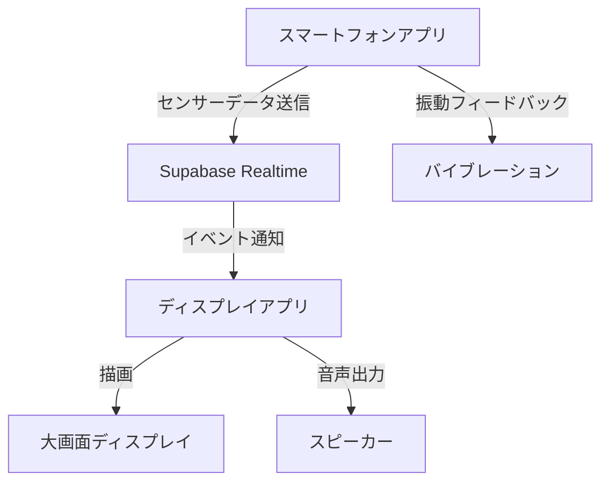

# Sky Canvas - 要件定義書

## 1. システムアーキテクチャ

### 1.1. 全体構成


### 1.2. コンポーネント構成
- **フロントエンド（スマートフォンアプリ）**
  - React + TypeScript
  - DeviceOrientation API
  - Vibration API
  - Supabase Client SDK
- **フロントエンド（ディスプレイアプリ）**
  - React + TypeScript
  - Three.js / WebGL
  - Web Audio API
  - Supabase Client SDK
- **バックエンド**
  - Supabase
  - PostgreSQL
  - Realtime Subscription

## 2. 機能仕様

### 2.1. スマートフォンアプリ仕様

#### 2.1.1. センサー制御
- **傾き検知**
  ```typescript
  interface TiltData {
    alpha: number;  // z軸周りの回転角（0-360度）
    beta: number;   // x軸周りの回転角（-180-180度）
    gamma: number;  // y軸周りの回転角（-90-90度）
    timestamp: number;
  }
  ```
  - 更新頻度: 60Hz
  - フィルタリング: 移動平均（直近5サンプル）
  - 閾値: 傾き15度以上で反応

- **ジェスチャー検知**
  ```typescript
  interface GestureData {
    type: 'flick' | 'swing';
    direction: 'up' | 'down' | 'left' | 'right';
    intensity: number;  // 0-1の範囲
    timestamp: number;
  }
  ```
  - フリック判定: 200ms以内の急速な動き
  - スイング判定: 500ms以内の円弧運動

#### 2.1.2. データ送信
- **Supabaseイベントフォーマット**
  ```typescript
  interface FireworkEvent {
    id: string;
    type: 'tilt' | 'gesture';
    data: TiltData | GestureData;
    userId: string;
    deviceType: string;
    timestamp: number;
    vibe: {
      color: string;
      size: number;
      pattern: string;
      seed: number;
    };
  }
  ```

#### 2.1.3. フィードバック
- **振動パターン**
  - 発射時: 100ms
  - 爆発時: [50ms, 30ms, 80ms]
  - エラー時: [100ms, 100ms]

### 2.2. ディスプレイアプリ仕様

#### 2.2.1. 花火生成エンジン
- **パーティクルシステム**
  ```typescript
  interface Particle {
    position: Vector3;
    velocity: Vector3;
    color: Color;
    size: number;
    life: number;
    opacity: number;
  }
  ```
  - 最大パーティクル数: 10000個/花火
  - 更新頻度: 60fps
  - 物理演算: バーレット時間積分

- **花火パターン**
  ```typescript
  interface FireworkPattern {
    type: string;
    params: {
      radius: number;
      particleCount: number;
      colors: Color[];
      duration: number;
      spread: number;
    };
    animation: AnimationCurve;
  }
  ```

#### 2.2.2. サウンドエンジン
- **音声合成**
  - サンプリングレート: 44.1kHz
  - チャンネル: ステレオ
  - 効果音種類:
    - 打ち上げ音（ドップラー効果付き）
    - 爆発音（距離減衰付き）
    - 環境音（リバーブ付き）

### 2.3. データベース仕様

#### 2.3.1. テーブル定義
```sql
-- 花火イベントテーブル
CREATE TABLE firework_events (
  id UUID PRIMARY KEY DEFAULT gen_random_uuid(),
  user_id TEXT NOT NULL,
  event_type TEXT NOT NULL,
  event_data JSONB NOT NULL,
  vibe JSONB NOT NULL,
  created_at TIMESTAMPTZ DEFAULT NOW(),
  
  CONSTRAINT valid_event_type CHECK (event_type IN ('tilt', 'gesture'))
);

-- リアルタイム通知の有効化
ALTER PUBLICATION supabase_realtime ADD TABLE firework_events;
```

## 3. 非機能要件

### 3.1. パフォーマンス要件
- レイテンシー: 100ms以内（エンドツーエンド）
- フレームレート: 60fps安定
- 同時接続数: 最大10ユーザー
- データ転送量: 1ユーザーあたり最大1KB/秒

### 3.2. セキュリティ要件
- HTTPS通信の強制
- Supabase RLSの適用
- センサー許可の適切な取得
- クロスオリジン制限の設定

### 3.3. 信頼性要件
- 自動再接続機能
- エラー時のフォールバック表示
- クラッシュレポート収集

## 4. 開発環境・ツール

### 4.1. 必要なツール
- Node.js v18以上
- pnpm
- Visual Studio Code
- Chrome DevTools
- Supabase CLI

### 4.2. 推奨VSCode拡張機能
- ESLint
- Prettier
- TypeScript Vue Plugin
- Three.js Editor
- WebGL Shader Editor

## 5. デプロイメント

### 5.1. デプロイ環境
- フロントエンド: Vercel
- バックエンド: Supabase Cloud
- ドメイン: sky-canvas-demo.vercel.app

### 5.2. デプロイフロー
1. GitHub Actionsによる自動ビルド
2. ステージング環境でのE2Eテスト
3. 本番環境へのデプロイ
4. スモークテストの実行
