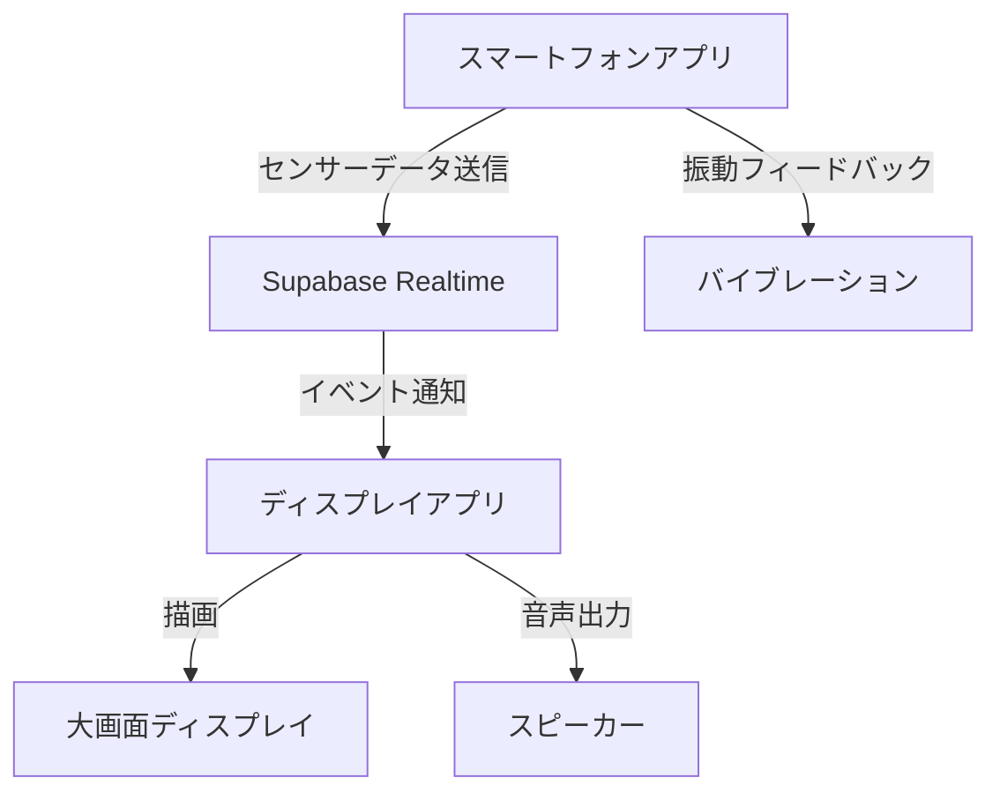

# Sky Canvas - 空に描く、あなたの創造力
## ハッカソン発表

---

# 夜空に物足りなさを感じていませんか？
### リアルな花火の制約...
*   場所の制限
*   費用の問題
*   環境への影響

### デジタルアートの限界...
*   共有のしにくさ
*   体験の限定性

私たちはこの課題を解決します。

---

# Sky Canvas とは？
### スマートフォンを振るだけで、空にデジタル花火を打ち上げる新しい体験！

*   **手軽さ**: いつでも、どこでも、気軽に花火体験
*   **創造性**: あなただけの花火を自由にデザイン
*   **共有の楽しさ**: 複数人で同時に、または作品を共有

---

# Key Features
*   **デバイス連携**: スマートフォンの傾きや動きで花火を操作
*   **インタラクティブ**: 音や振動と連動するエフェクト
*   **リアルタイム共有**: みんなで一緒に打ち上げ！
*   **高精細な描画**: WebGLとThree.jsで美しい花火を表現

---

# デモンストレーション
## 実際の「Sky Canvas」の世界を体験しよう！

<!--
    このスライドで実際のデモンストレーションを行います。
    事前にシナリオを準備し、スムーズな実演を心がけてください。
    強調したいポイント：
    - スマートフォンを傾けて花火の色や形を変える
    - 振る速さで打ち上げ方を変える
    - 複数人で同時に花火を打ち上げる様子
    - 音と振動のフィードバック
-->

---

# 技術的な挑戦
### 「Sky Canvas」を支えるテクノロジー

*   **Frontend**: React, TypeScript, Three.js, WebGL
*   **Device Interaction**: DeviceOrientation API, Vibration API, Web Audio API
*   **Backend / DB**: Supabase (リアルタイム通信、DB)
*   **Shared Logic**: モノレポ構成と共有パッケージ

これらの技術を組み合わせ、インタラクティブで没入感のある体験を実現しました。

---

# 今後の展望
### 「Sky Canvas」の可能性は無限大！

*   **短期的な改善**:
    *   花火の種類やエフェクトの追加
    *   より詳細なカスタマイズ機能
*   **長期的なビジョン**:
    *   イベント連携（フェス、カウントダウンなど）
    *   アーティストとのコラボレーション
    *   教育・エンターテイメント分野への展開

---

# あなたの空に、無限の創造力を。
## Sky Canvas

--- 