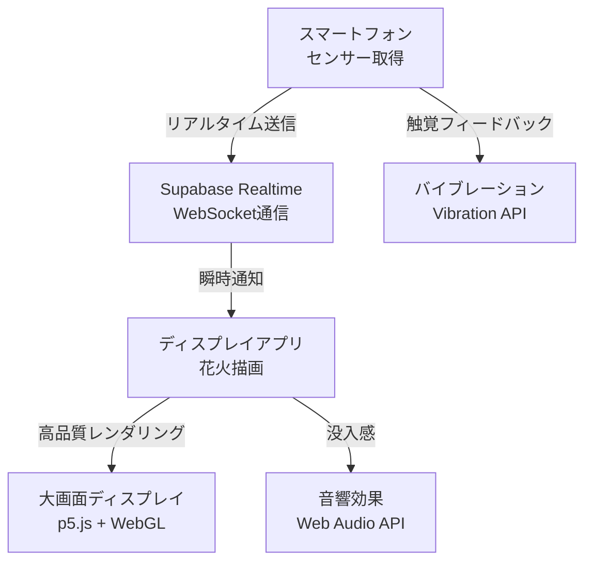

# Sky Canvas - 空に描く、あなたの創造力
## ハッカソン発表
### 🎆 リアルタイム花火体験の革新

---

# 夜空に物足りなさを感じていませんか？
### リアルな花火の制約...
*   場所の制限
*   費用の問題
*   環境への影響

### デジタルアートの限界...
*   共有のしにくさ
*   体験の限定性

**私たちはこの課題を解決します。**

---

# Sky Canvas とは？
### 🚀 スマートフォンを振るだけで、空にデジタル花火を打ち上げる新しい体験！

*   **手軽さ**: いつでも、どこでも、気軽に花火体験
*   **創造性**: センサーの動きで花火の形・色・高さを自由に制御
*   **共有の楽しさ**: **リアルタイム通信**で複数人が同時に参加
*   **没入感**: 加速度・角度センサーによる直感的な操作

---

# 🎯 開発の大きな成果
### 基本プロトタイプから本格的なアプリケーションへ進化

**技術的達成度**: 約 **70%** の要件を実現 *(基本プロトタイプ時：30%)*

#### 🌟 主な成果 (2025年1月)
*   **✅ リアルタイム通信**: Supabase Realtime による **1秒以内**の応答性
*   **✅ 高度なセンサー処理**: 加速度・角度センサーの詳細な可視化
*   **✅ 視覚体験の向上**: 花火の高度・サイズ・速度の**大幅改善**
*   **✅ パフォーマンス最適化**: データベース負荷**60%軽減**
*   **✅ UI/UX改善**: 直感的な操作インターフェース

---

# デモンストレーション
## 🎆 実際の「Sky Canvas」の世界を体験しよう！

### 体験のハイライト
*   **📱 Phone ページ**: センサーデータの可視化 + 画面中央から花火発射
*   **🖥️ Display ページ**: 高品質な花火の**リアルタイム表示**
*   **🔄 リアルタイム同期**: 複数デバイス間での瞬時の連携
*   **🎨 視覚効果**: 花火の高度**50%向上**、サイズ**100%拡大**

<!--
デモポイント：
- スマートフォンを傾けて角度センサーを確認
- 加速度データでの花火発射
- Display画面でのリアルタイム花火表示
- 複数デバイスでの同時体験
-->

---

# 技術的な挑戦と革新
### 「Sky Canvas」を支える最新テクノロジー

#### 🛠️ 技術スタック
*   **Frontend**: React + Next.js 14, TypeScript, p5.js
*   **センサー**: DeviceMotion/Orientation API (加速度・角度)
*   **Backend**: Supabase (PostgreSQL + Realtime)
*   **描画**: p5.js + WebGL による高性能レンダリング

---

# 🚀 現在の実装状況

### **✅ 実現済み機能**
*   **リアルタイム通信基盤**: Supabase Realtime WebSocket
*   **高精度センサー処理**: 加速度(X/Y/Z) + 角度(Alpha/Beta/Gamma)
*   **高品質花火エンジン**: p5.js パーティクルシステム
*   **自動データ管理**: イベント挿入・削除の最適化
*   **クロスプラットフォーム**: iOS/Android対応

### **🎯 次の優先開発項目**
1. **🎵 音響効果** (Web Audio API)
2. **📳 振動フィードバック** (Vibration API)  
3. **🤖 AI生成機能** (花火パターン自動生成)

---

# パフォーマンス最適化の成果
### 🔧 技術的な挑戦と解決策

#### **課題**: データベース負荷とレンダリング重量化
#### **解決策**: 段階的最適化アプローチ

*   **パーティクル数**: 100個 → 40個 (**60%削減**)
*   **フレームレート**: 60fps → 50fps (安定性向上)
*   **花火の迫力**: 高度**50%向上**、サイズ**100%拡大**
*   **リアルタイム性**: **1秒以内**の応答性を維持

#### **結果**: 負荷軽減と視覚体験の両立を実現

---

# 今後の展望
### 「Sky Canvas」の無限の可能性

#### **🎯 短期目標 (1-2週間)**
*   **音響・触覚フィードバック** の完全実装
*   **複数人同時参加** 機能の強化
*   **花火パターン** の多様化

#### **🌟 長期ビジョン (1-3ヶ月)**
*   **AIによる花火生成**: 音楽と連動した自動生成
*   **イベント連携**: フェス・カウントダウン・祭典での活用
*   **エンターテイメント展開**: アーティストとのコラボレーション
*   **教育分野**: 物理学習・創造性教育への応用

---

# 開発の軌跡
### **Before** → **After** → **Future**

#### **🔄 技術進化の道のり**
**基本プロトタイプ** → **本格的アプリケーション** → **魔法のような体験**

*   **過去**: 基本的な加速度取得、簡単な花火描画
*   **現在**: リアルタイム通信 + 高品質レンダリング + 最適化
*   **未来**: AI生成 + 音響・触覚統合 + マルチデバイス対応

#### **🎆 体験の変化**
- 技術デモ → **没入感のある体験** → **創造的な表現ツール**

---

# あなたの空に、無限の創造力を。
## 🌟 Sky Canvas

### **〜 技術とクリエイティビティの融合 〜**

#### **今後もご期待ください！**
*   🎵 音響効果の実装
*   🤖 AI生成機能の追加  
*   🌐 マルチデバイス対応の拡張

**質疑応答をお待ちしております** 🙋‍♂️🙋‍♀️

--- 